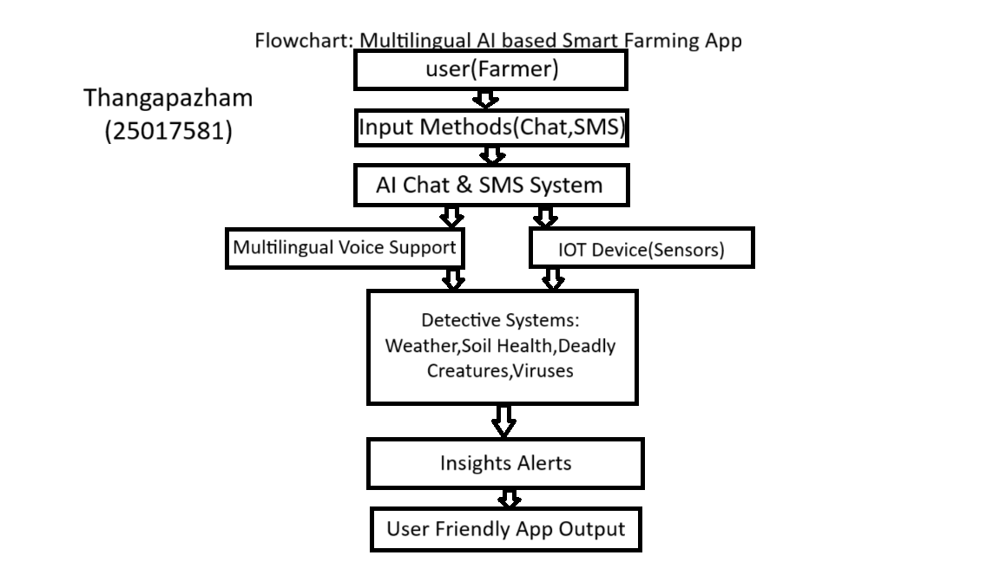

# Smart India Hackathon Workshop
# Date:
## Register Number:
## Name:
## Problem Title
SIH 25010: Smart Crop Advisory System for Small and Marginal Farmers
## Problem Description
A majority of small and marginal farmers in India rely on traditional knowledge, local shopkeepers, or guesswork for crop selection, pest control, and fertilizer use. They lack access to personalized, real-time advisory services that account for soil type, weather conditions, and crop history. This often leads to poor yield, excessive input costs, and environmental degradation due to overuse of chemicals. Language barriers, low digital literacy, and absence of localized tools further limit their access to modern agri-tech resources.

Impact / Why this problem needs to be solved

Helping small farmers make informed decisions can significantly increase productivity, reduce costs, and improve livelihoods. It also contributes to sustainable farming practices, food security, and environmental conservation. A smart advisory solution can empower farmers with scientific insights in their native language and reduce dependency on unreliable third-party advice.

Expected Outcomes

• A multilingual, AI-based mobile app or chatbot that provides real-time, location-specific crop advisory.
• Soil health recommendations and fertilizer guidance.
• Weather-based alerts and predictive insights.
• Pest/disease detection via image uploads.
• Market price tracking.
• Voice support for low-literate users.
• Feedback and usage data collection for continuous improvement.

Relevant Stakeholders / Beneficiaries

• Small and marginal farmers
• Agricultural extension officers
• Government agriculture departments
• NGOs and cooperatives
• Agri-tech startups

Supporting Data

• 86% of Indian farmers are small or marginal (NABARD Report, 2022).
• Studies show ICT-based advisories can increase crop yield by 20–30%.

## Problem Creater's Organization
Government of Punjab

## Theme
Agriculture, FoodTech & Rural Development

## Proposed Solution
<h3>AI powered IOT system</h3>
<ul><li>An AI powered IOT system it is an mobile application. It can detect climate every minute , detect soil condition every hour, it can detect insects and detect plant viruses.</li>
<li>It can reduce wastage by dedecting every minute. It is an multi-lingual mobile application so everyone use it easily. Onemore thing is it is comes with multi-lingual voice assistant. So the person no needed for reading ability. Because many of the farmers in INDIA don't have reading ability. It can tell where to sell and what the price they given.</li>
<li>The uniqueness of this idea is first the iot device is divided the land 1m each so if the problem happen we don't needed for search where it is happen the device show it. It can detect deadly creatures like snake,card bug,etc. So the person know where to go where don't know. Moreover it gives the location where to buy things to solve the problem,so the person no needed for search for things. </li></ul>

## Technical Approach
<h3>Tools to use</h3>
<ul><li>python for train AI models, java for android app, firebase for realtime database, IOT devices.
</li>
<li>collect data about soil, wheather and detect viruses,creatures and connect APIs for weather data and more.<b> Coduct trials in punjab local villages. </b></li></ul>

## Feasibility and Viability
<h3>Feasibility and Viability</h3>
<ul><li>It can be success if the app's marketing and advertisement is good.</li>
<li>Many of the indian farmers still use keypad mobile so they don't have access on application and some of the farmers even have keypad mobile they don't have knowledge to how to use it.</li>
<li>Spread awarness of this app. If the farmer only have keypad mobile send the sms about land,wheather,etc. Make a AI based caller system for it, if they dial the numbers it will ask what you want to know in thier language and the user enter the number of what he want to know then it tell about it.</li></ul>

## Impact and Benefits
<h3>New Revolution</h3>
<ul><li>It can reduce lot of wastages so we can make money by import it, when government take actions officially.</li>
<li>It save more time,energy and make poverty level zero.</li></ul>

## Research and References
<h3>Research</h3>
<ul><li>From the website called deviceauthority.com   http://deviceauthority.com/artificial-intelligence-in-iot-enhancing-connectivity-and-efficiency/</li></ul>
